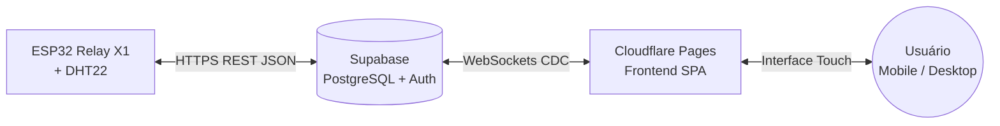
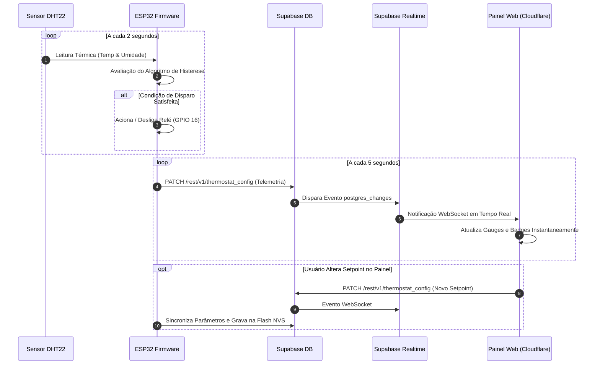

# 📘 DOCUMENTAÇÃO TÉCNICA: PLACA DE CONTROLE E PROJETO WEB IOT
### *Módulo ESP32 Relay X1 V1.2 • Sensor DHT22 • Plataforma Web Cloudflare Pages & Supabase Cloud*

---

## 📑 ÍNDICE DA DOCUMENTAÇÃO

1. [Especificações Técnicas da Placa ESP32_RELAY X1_V1.2](#1-especificações-técnicas-da-placa-esp32_relay-x1_v12)
2. [Pinout, Conexões e Mapeamento de Hardware](#2-pinout-conexões-e-mapeamento-de-hardware)
3. [Esquema de Ligação Elétrica do Sensor e da Carga](#3-esquema-de-ligação-elétrica-do-sensor-e-da-carga)
4. [Engenharia do Sensor de Temperatura e Umidade DHT22](#4-engenharia-do-sensor-de-temperatura-e-umidade-dht22)
5. [Estágio de Potência e Acionamento do Relé de Carga](#5-estágio-de-potência-e-acionamento-do-relé-de-carga)
6. [Arquitetura da Aplicação Web e Infraestrutura de Nuvem](#6-arquitetura-da-aplicação-web-e-infraestrutura-de-nuvem)
7. [Fluxo de Dados em Tempo Real (Realtime Pipeline)](#7-fluxo-de-dados-em-tempo-real-realtime-pipeline)
8. [Procedimentos de Comissionamento, Teste e Segurança](#8-procedimentos-de-comissionamento-teste-e-segurança)

---

# 1. ESPECIFICAÇÕES TÉCNICAS DA PLACA ESP32_RELAY X1_V1.2

A placa **ESP32_RELAY X1_V1.2** é uma plataforma compacta de automação industrial e predial que combina a alta capacidade computacional do SoC **ESP32-WROOM-32E** com um estágio de acionamento de potência isolado por relé.

```
+------------------------------------+---------------------------------------------------+
| REQUISITO / ESPECIFICAÇÃO          | DETALHAMENTO DE ENGENHARIA                        |
+------------------------------------+---------------------------------------------------+
| Microcontrolador Central           | Espressif ESP32-WROOM-32E (Dual-Core Xtensa 32-bit)|
| Frequência de Operação (Clock)     | 240 MHz (até 600 DMIPS)                           |
| Memória SRAM Interna               | 520 KB SRAM                                       |
| Memória Flash Externa              | 4 MB SPI Flash (com suporte a NVS e OTA)          |
| Conectividade Sem Fio              | Wi-Fi 802.11 b/g/n (2.4 GHz) + Bluetooth v4.2 BLE|
| Tensão de Operação Lógica          | 3.3V DC                                           |
| Tensão de Entrada de Alimentação   | 5V DC via Micro-USB ou Borne de Entrada           |
| Regulador de Tensão Linear (LDO)   | AMS1117-3.3V (Saída de até 800 mA com ripple baixo)|
| Relé Eletromecânico de Potência    | 1 Canal SPDT (Songle / Equivalente Industrial)    |
| Capacidade de Carga do Relé        | 10A @ 250VAC / 10A @ 30VDC                        |
| Interface Serial / Gravador        | USB-UART com chip CP2102 ou CH340                 |
+------------------------------------+---------------------------------------------------+
```

---

# 2. PINOUT, CONEXÕES E MAPEAMENTO DE HARDWARE

### 📍 Tabela de Pinos do Microcontrolador:

| Pino / GPIO | Função Associada | Direção | Nível Elétrico | Descrição Funcional |
| :--- | :--- | :--- | :--- | :--- |
| **GPIO 4** | Linha de Dados DHT22 | Bidirecional | 3.3V Digital | Barramento de telemetria serial 1-Wire do sensor de temperatura e umidade. |
| **GPIO 16** | Driver do Relé | Saída | 3.3V Digital | Nível lógico **HIGH (1)** liga o relé; Nível lógico **LOW (0)** desliga o relé. |
| **GPIO 0** | Botão BOOT | Entrada | Pull-up Interno | Pressionado durante o boot coloca o ESP32 em modo de gravação UART. |
| **GPIO 1** | UART0 TXD | Saída | 3.3V Serial | Linha de transmissão serial (Debug e Log a 115200 bps). |
| **GPIO 3** | UART0 RXD | Entrada | 3.3V Serial | Linha de recepção serial para upload de firmware. |
| **3V3** | Alimentação Lógica | Saída | +3.3V DC | Barramento regulado para sensores e circuitos de sinal. |
| **5V / VIN**| Alimentação Principal | Entrada | +5.0V DC | Alimentação geral da placa e bobina do relé. |
| **GND** | Referência Elétrica | Comum | 0V DC | Terra de sinal e alimentação do circuito. |

---

# 3. ESQUEMA DE LIGAÇÃO ELÉTRICA DO SENSOR E DA CARGA

```
                              +---------------------------------------+
                              |         ESP32_RELAY X1_V1.2           |
                              |                                       |
                              |   [3.3V] --------+                    |
                              |                  |                    |
                              |   [GPIO 4] ------|----+               |
                              |                  |    |               |
                              |   [GND] ---------|----|----+          |
                              |                  |    |    |          |
                              |   [GPIO 16] -----> Driver Relé        |
                              |                       |               |
                              |                 [COM] [NO] [NC]       |
                              +-------------------+----+---------------+
                                                  |    |
                      +---------------------------+    |
                      |                                |
                      v                                v
                [Rede AC 110V/220V]             [Carga: Compressor,
                   (Fase / Linha)              Resistência ou Bomba]
                                                       |
                                                       v
                                              [Rede AC Neutro / Retorno]

              +------------------------------------------+
              |      SENSOR DIGITAL DHT22 / AM2302       |
              |                                          |
              |   Pino 1 (VCC)  ---> Conectar ao 3.3V     |
              |   Pino 2 (DATA) ---> Conectar ao GPIO 4  |
              |   Pino 3 (NC)   ---> Não Conectado       |
              |   Pino 4 (GND)  ---> Conectar ao GND     |
              |                                          |
              |   * Resistor Pull-up de 10kΩ entre       |
              |     VCC (Pino 1) e DATA (Pino 2)         |
              +------------------------------------------+
```

---

# 4. ENGENHARIA DO SENSOR DE TEMPERATURA E UMIDADE DHT22

O sensor **DHT22 (AM2302)** utiliza um elemento capacitivo de umidade e um termistor NTC para medição de ar ambiente com alta estabilidade a longo prazo.

### 📊 Características Metrológicas:
- **Faixa de Temperatura:** -40.0 °C a +80.0 °C (Resolução: 0.1 °C | Exatidão: ±0.5 °C).
- **Faixa de Umidade:** 0.0% a 99.9% UR (Resolução: 0.1% UR | Exatidão: ±2.0% UR).
- **Período de Amostragem Recomendado:** 2 a 5 segundos (evita o autoaquecimento do chip interno).
- **Protocolo de Comunicação:** Trem de pulsos de 40 bits (16 bits de umidade, 16 bits de temperatura, 8 bits de checksum de paridade).

---

# 5. ESTÁGIO DE POTÊNCIA E ACIONAMENTO DO RELÉ DE CARGA

O estágio de saída isolado permite acionar cargas indutivas e resistivas com total segurança galvânica:
- **Contatos SPDT Disponíveis:**
  - **COM (Comum):** Entrada da fase ou tensão de alimentação da carga.
  - **NO (Normalmente Aberto):** Conduz apenas quando o relé é acionado pelo firmware (circuito de trabalho padrão).
  - **NC (Normalmente Fechado):** Conduz quando o relé está desligado e abre quando energizado.
- **Proteção Indutiva:** Diodo Flyback em antiparalelo com a bobina para supressão de surtos de tensão (back-EMF).
- **Recomendação para Cargas Indutivas Pesadas (Motores/Compressores):** Instalar um filtro Snubber RC (resistor de 100Ω 2W em série com capacitor de 100nF 400V) em paralelo com os contatos para estender a vida útil do relé.

---

# 6. ARQUITETURA DA APLICAÇÃO WEB E INFRAESTRUTURA DE NUVEM



### 🌐 Camadas da Solução Web:
1. **Frontend Serverless Edge (Cloudflare Pages):**
   - Single Page Application (SPA) ultra-leve desenvolvida em Vanilla HTML5, Tailwind CSS e JavaScript.
   - Padrão **Mobile-First**: Touch targets de 44x48px, zero zoom no iOS, design responsivo fluido e cabeçalhos de segurança contra cache persistente.
2. **Backend Serverless & Database (Supabase):**
   - **Banco de Dados Relacional:** PostgreSQL 15 com tabelas `thermostat_config` e `thermostat_logs`.
   - **Autenticação Segura:** Supabase GoTrue (JWT Tokens e controle de acesso).
   - **Segurança:** Políticas Row Level Security (RLS) ativadas.
   - **Engine em Tempo Real:** WebSockets via PostgreSQL Logical Replication CDC.

---

# 7. FLUXO DE DADOS EM TEMPO REAL (REALTIME PIPELINE)



---

# 8. PROCEDIMENTOS DE COMISSIONAMENTO, TESTE E SEGURANÇA

1. **Inspeção Visual Inicial:** Verificar se não há curtos-circuitos nas soldas dos bornes e garantir que a linha de 3.3V não esteja conectada diretamente à rede elétrica.
2. **Gravação do Firmware:**
   - Conectar cabo USB de dados na porta COM do computador.
   - Compilar e gravar via PlatformIO a 115200 baud.
3. **Provisionamento de Rede Wi-Fi:**
   - Conectar na rede AP `Termostato-ESP32-Setup` (senha: `12345678`).
   - Salvar o SSID e senha do Wi-Fi local através do portal captivo `192.168.4.1`.
4. **Validação em Nuvem:**
   - Abrir o dashboard no Cloudflare Pages.
   - Efetuar login com as credenciais cadastradas no Supabase Auth.
   - Verificar a telemetria ao vivo com status `ESP32 Online`.
