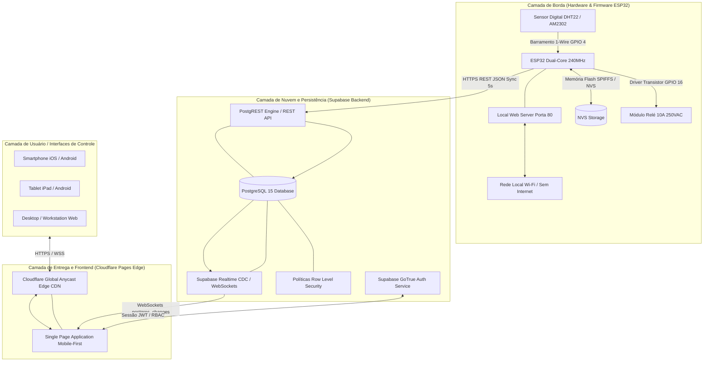
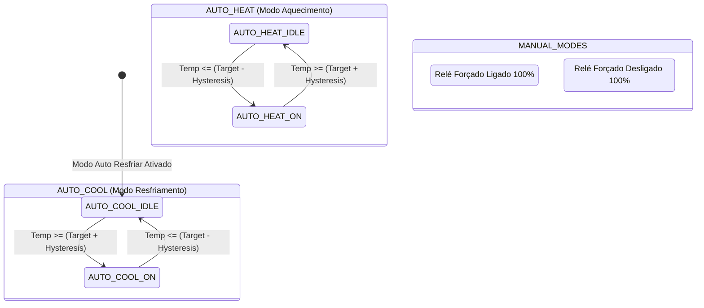

# 🌡️ SISTEMA INDUSTRIAL DE TERMOSTATO DIGITAL IOT & WEB CONTROL
### *Arquitetura Integrada: ESP32 Relay X1 • Sensor DHT22 • Supabase Cloud Realtime • Cloudflare Pages Edge Serverless • NVS Flash Dual-Mode*

---

## 📑 ÍNDICE GERAL DE CONTEÚDO

1. [Visão Geral Executiva e Arquitetura do Sistema](#1-visão-geral-executiva-e-arquitetura-do-sistema)
2. [Arquitetura de Hardware e Engenharia Eletrônica](#2-arquitetura-de-hardware-e-engenharia-eletrônica)
   - 2.1. Unidade de Processamento Central (SoC ESP32-WROOM-32E)
   - 2.2. Sensor de Temperatura e Umidade de Precisão (DHT22 / AM2302)
   - 2.3. Estágio de Potência, Relé Eletromecânico e Isolamento Galvânico
   - 2.4. Circuito de Alimentação, Reguladores de Tensão e Desacoplamento
   - 2.5. Tabela de Mapeamento Completo de GPIOs e Pinagem
   - 2.6. Esquema de Ligação Elétrica e Diagrama Esquemático
3. [Arquitetura de Firmware e Software Embarcado](#3-arquitetura-de-firmware-e-software-embarcado)
   - 3.1. Estrutura de Diretórios e Toolchain (PlatformIO / C++ / FreeRTOS)
   - 3.2. Gerenciador de Conectividade Wi-Fi e Captive Portal (WiFiManager)
   - 3.3. Servidor Web Local e Dashboard Offline Autônomo (Porta 80)
   - 3.4. Persistência de Dados em Memória Não-Volátil (Flash NVS)
   - 3.5. Algoritmo de Controle Termostático com Histerese Dinâmica
   - 3.6. Comunicação Segura com o Backend Supabase (HTTPS REST Client)
   - 3.7. Máquina de Estados Finita (FSM) do Firmware
4. [Infraestrutura de Nuvem e Banco de Dados Supabase](#4-infraestrutura-de-nuvem-e-banco-de-dados-supabase)
   - 4.1. Modelagem Relacional e Esquema DDL do PostgreSQL
   - 4.2. Segurança e Controle de Acesso Baseado em Políticas (RLS - Row Level Security)
   - 4.3. Motor em Tempo Real Supabase Realtime (CDC / WebSockets)
   - 4.4. Autenticação e Gestão Criptográfica de Sessões (GoTrue / JWT)
5. [Frontend Web, Interface de Usuário e Padrão Mobile-First](#5-frontend-web-interface-de-usuário-e-padrão-mobile-first)
   - 5.1. Padrões de Design Responsivo e Conformidade com a Skill Mobile-First
   - 5.2. Arquitetura da Interface SPA (Single Page Application)
   - 5.3. Tela de Login e Barreira de Autenticação Segura
   - 5.4. Dashboard de Monitoramento e Controles Interativos Touch-Friendly
   - 5.5. Renderização de Gráficos e Histórico Temporal (Chart.js)
   - 5.6. Políticas de Cache e Cabeçalhos HTTP de Segurança no Cloudflare Pages
6. [Guia Passo a Passo de Instalação, Compilação e Gravação](#6-guia-passo-a-passo-de-instalação-compilação-e-gravação)
   - 6.1. Requisitos de Software e Drivers Seriais
   - 6.2. Configuração do Banco de Dados no Supabase
   - 6.3. Compilação e Gravação do Firmware via PlatformIO no ESP32
   - 6.4. Provisionamento da Rede Wi-Fi pelo Captive Portal
   - 6.5. Publicação do Frontend no Cloudflare Pages
7. [Manual de Operação e Guia do Usuário](#7-manual-de-operação-e-guia-do-usuário)
   - 7.1. Modos de Operação (Auto Resfriar, Auto Aquecer, Forçar ON, Forçar OFF)
   - 7.2. Ajuste de Setpoint e Margem de Histerese
   - 7.3. Operação em Modo Offline (Sem Internet)
8. [Manutenção Preventiva, Calibração e Resolução de Problemas (Troubleshooting)](#8-manutenção-preventiva-calibração-e-resolução-de-problemas-troubleshooting)
   - 8.1. Matriz de Falhas e Soluções Rápidas
   - 8.2. Calibração e Cuidados com o Sensor DHT22
   - 8.3. Diagnóstico Serial e Monitoramento de Memória Heap
9. [Especificações Técnicas e Parâmetros Operacionais](#9-especificações-técnicas-e-parâmetros-operacionais)
10. [Licença e Direitos Autorais](#10-licença-e-direitos-autorais)

---

# 1. VISÃO GERAL EXECUTIVA E ARQUITETURA DO SISTEMA

O **Termostato Digital Web Industrial** é uma solução de engenharia de automação e climatização conectada (IoT) de alta disponibilidade, desenvolvida para proporcionar controle rigoroso, monitoramento contínuo e telemetria em tempo real de ambientes climatizados, câmaras frias, estufas, data centers, adegas e cervejarias artesanais.

O projeto resolve uma das principais vulnerabilidades de sistemas IoT tradicionais: **a dependência exclusiva de conexão com a Internet**. Com uma arquitetura híbrida de execução dual (*Dual-Mode Architecture*), o sistema mantém 100% de sua inteligência de controle de temperatura e controle do relé de forma local e autônoma caso ocorra perda de sinal Wi-Fi ou queda na conexão com a nuvem, persistindo parâmetros operacionais diretamente na memória flash não-volátil (NVS) do microcontrolador.

### 🌐 Diagrama Global de Arquitetura de Comunicação e Serviços



---

# 2. ARQUITETURA DE HARDWARE E ENGENHARIA ELETRÔNICA

## 2.1. Unidade de Processamento Central (SoC ESP32-WROOM-32E)
O núcleo do sistema é fundamentado no módulo microcontrolador **ESP32-WROOM-32E** (Espressif Systems), montado na placa de desenvolvimento **ESP32_RELAY X1_V1.2**.
- **Processador**: Dual-Core 32-bit Xtensa LX6 operando a uma frequência de clock programável de até 240 MHz (desempenho computacional de até 600 DMIPS).
- **Memória SRAM Interna**: 520 KB de memória estática de alta velocidade.
- **Memória Flash Externa**: 4 MB SPI Flash integrada (suporte a particionamento NVS e OTA - Over-The-Air Update).
- **Transceptor Sem Fio**: Wi-Fi 802.11 b/g/n (2.4 GHz) com potência de transmissão de até +20.5 dBm e Bluetooth v4.2 BR/EDR & BLE.
- **Criptografia por Hardware**: Aceleradores criptográficos dedicados para AES-128/192/256, SHA-2, RSA, ECC e Gerador de Números Aleatórios Reais (RNG), garantindo conexões TLS/HTTPS de alta performance com baixo impacto na CPU.

## 2.2. Sensor de Temperatura e Umidade de Precisão (DHT22 / AM2302)
Para medição das grandezas termodinâmicas ambientais, utiliza-se o sensor digital capacitivo de temperatura e umidade **DHT22** (referência de mercado AM2302).
- **Faixa de Medição de Temperatura**: -40.0 °C a +80.0 °C.
- **Resolução de Temperatura**: 0.1 °C.
- **Exatidão Térmica**: ±0.5 °C na faixa típica de climatização.
- **Faixa de Medição de Umidade**: 0.0% a 99.9% de Umidade Relativa (UR).
- **Resolução de Umidade**: 0.1% UR.
- **Exatidão de Umidade**: ±2% UR.
- **Protocolo de Comunicação**: Barramento proprietário serial 1-Wire Single-Bus digital assíncrono.
- **Tempo Mínimo de Amostragem**: 2000 ms (2 segundos) entre ciclos de leitura para dissipação do autoaquecimento interno.

### 📐 Protocolo 1-Wire do DHT22:
A leitura dos dados é realizada em um trem de pulso de 40 bits (5 bytes):
1. **Byte 1 e Byte 2**: Umidade Relativa (Multiplicada por 10, MSB primeiro).
2. **Byte 3 e Byte 4**: Temperatura em Celsius (Multiplicada por 10, MSB primeiro; se o bit mais significativo for 1, a temperatura é negativa).
3. **Byte 5**: Checksum de paridade matemática, onde:
   $$\text{Checksum} = (\text{Byte}_1 + \text{Byte}_2 + \text{Byte}_3 + \text{Byte}_4) \pmod{256}$$

## 2.3. Estágio de Potência, Relé Eletromecânico e Isolamento Galvânico
O controle de potência de atuadores (compressores de refrigeração, aquecedores resistivos, bombas d'água, solenoides) é intermediado por um relé eletromecânico SPDT (Single Pole Double Throw):
- **Tensão Máxima de Chaveamento AC**: 250 VAC @ 10 A (Carga Resistiva) / 125 VAC @ 10 A.
- **Tensão Máxima de Chaveamento DC**: 30 VDC @ 10 A.
- **Isolamento Galvânico**: Barreira de isolamento físico entre o circuito digital de 3.3V/5V e o circuito de potência CA/CC, acionado via circuito transistorizado de chaveamento no **GPIO 16**.
- **Diodo de Roda Livre (Flyback Diode)**: Diodo supressor de transientes conectado em antiparalelo com a bobina do relé para neutralizar a força contraeletromotriz (back-EMF) gerada na desenergização, protegendo o transistor de acionamento contra sobretensão destrutiva.

## 2.4. Circuito de Alimentação, Reguladores de Tensão e Desacoplamento
- **Entrada de Alimentação**: Conector Micro-USB / Borne de entrada de 5V DC (ou 7V a 12V DC com regulador buck integrado dependendo da revisão).
- **Regulador LDO de Tensão**: CI AMS1117-3.3V com capacidade de fornecimento de corrente de até 800 mA com ripple mínimo.
- **Filtragem e Desacoplamento**: Capacitores cerâmicos de 100 nF para eliminação de ruído de alta frequência e capacitores eletrolíticos de tântalo de 10 µF e 470 µF para absorção dos picos transitórios de corrente do rádio Wi-Fi (que podem atingir picos de até 500 mA durante rajadas de transmissão TX).

## 2.5. Tabela de Mapeamento Completo de GPIOs e Pinagem

| Pino ESP32 | Função de Hardware | Descrição Elétrica | Nível Lógico / Estado |
| :--- | :--- | :--- | :--- |
| **GPIO 4** | Sensor DHT22 DATA | Entrada/Saída Digital 1-Wire com resistor pull-up de 4.7kΩ a 10kΩ | 3.3V Lógico |
| **GPIO 16** | Bobina do Relé (Carga) | Saída Digital conectada à base do transistor de chaveamento | HIGH (1) = Acionado, LOW (0) = Desligado |
| **GPIO 0** | Botão BOOT / Flash | Entrada Digital com pull-up interno. Usado para gravação UART | LOW durante o boot entra em ROM Bootloader |
| **GPIO 1** | UART0 TXD | Linha de Transmissão Serial de Depuração e Gravação | 115200 Baud |
| **GPIO 3** | UART0 RXD | Linha de Recepção Serial de Gravação e Comandos | 115200 Baud |
| **3V3** | Alimentação Lógica | Saída do Regulador de Tensão Linear LDO AMS1117 | +3.3V DC (±2%) |
| **GND** | Plano de Terra | Referência comum de potencial elétrico | 0V DC |

## 2.6. Esquema de Ligação Elétrica e Diagrama Esquemático

```
           +---------------------------------------------+
           |           ESP32_RELAY X1_V1.2 PLACA         |
           |                                             |
           |   [3.3V] --------+                          |
           |                  |                          |
           |   [GPIO 4] ------|----+                     |
           |                  |    |                     |
           |   [GND] ---------|----|----+                |
           |                  |    |    |                |
           |   [GPIO 16] -----> Driver Relé Integrado    |
           |                    |                        |
           |                    v                        |
           |             [COM] [NO] [NC] (Bornes Relé)   |
           +---------------------------------------------+
                              |    |    |
                              |    |    |
           +------------------+----+----+----------------+
           | SENSOR DIGITAL DHT22 (AM2302)               |
           | Pino 1: VCC (Conectar ao 3.3V)              |
           | Pino 2: DATA (Conectar ao GPIO 4)           |
           | Pino 3: NC (Não Conectado)                  |
           | Pino 4: GND (Conectar ao GND)               |
           | * Resistor pull-up de 10k entre VCC e DATA  |
           +---------------------------------------------+
```

---

# 3. ARQUITETURA DE FIRMWARE E SOFTWARE EMBARCADO

## 3.1. Estrutura de Diretórios e Toolchain (PlatformIO / C++ / FreeRTOS)
O firmware foi projetado em conformidade com as melhores práticas de engenharia de software para sistemas embarcados de missão crítica, compilado utilizando a infraestrutura **PlatformIO Core** sob a framework **Arduino-ESP32 / ESP-IDF**.

```
firmware/
├── include/
│   └── config.h              <- Constantes de hardware, endpoints e timers
├── src/
│   └── main.cpp              <- Loop de controle, FreeRTOS, HTTP server e Supabase REST
├── lib/                      <- Bibliotecas modulares auxiliares
├── test/                     <- Testes unitários de hardware e lógica
└── platformio.ini            <- Configuração de compilação, dependências e velocidade
```

### Configuração do `platformio.ini`:
```ini
[env:esp32dev]
platform = espressif32
board = esp32dev
framework = arduino
monitor_speed = 115200
upload_speed = 115200
board_build.partitions = min_spiffs.csv
lib_deps =
    adafruit/DHT sensor library @ ^1.4.4
    adafruit/Adafruit Unified Sensor @ ^1.1.9
    bblanchon/ArduinoJson @ ^6.21.3
    https://github.com/tzapu/WiFiManager.git
```

## 3.2. Gerenciador de Conectividade Wi-Fi e Captive Portal (WiFiManager)
Para eliminar a necessidade de recompilação do firmware sempre que o usuário trocar de rede Wi-Fi ou alterar a senha do roteador, o sistema integra o motor **WiFiManager com Captive Portal Inteligente**:
1. Durante a inicialização no `setup()`, o firmware tenta se conectar automaticamente às credenciais salvas na memória NVS Flash.
2. Caso a conexão falhe ou a rede não seja encontrada dentro de uma janela de tolerância, o ESP32 entra automaticamente em **Modo Ponto de Acesso (AP)** com as configurações:
   - **Nome da Rede (SSID)**: `Termostato-ESP32-Setup`
   - **Senha de Segurança**: `12345678`
   - **IP do Portal Captivo**: `192.168.4.1`
   - **DNS Redirect**: Qualquer tentativa de navegação no celular/computador redireciona o usuário para o formulário de seleção e digitação da senha da rede Wi-Fi doméstica/industrial.
3. **Timeout de Proteção (180 segundos)**: Caso ninguém configure o Wi-Fi no portal em até 3 minutos, o ESP32 desliga o ponto de acesso e assume o funcionamento no **Modo 100% Offline Autônomo**, garantindo que o controle da temperatura nunca seja interrompido.

## 3.3. Servidor Web Local e Dashboard Offline Autônomo (Porta 80)
Mesmo quando conectado à rede Wi-Fi local sem acesso à Internet externa, o ESP32 hospeda um **WebServer HTTP assíncrono nativo na porta 80**:
- **Endpoint `/` (GET)**: Renderiza um dashboard HTML5 responsivo ultra-otimizado direto da memória Flash, exibindo a temperatura atual, umidade, estado do relé e formulário de ajuste.
- **Endpoint `/api/data` (GET)**: Retorna um payload JSON leve com a telemetria instantânea:
  ```json
  {
    "temperature": 22.8,
    "humidity": 65.4,
    "target_temperature": 25.0,
    "hysteresis": 1.0,
    "mode": "AUTO_COOL",
    "relay_state": true,
    "uptime_seconds": 3840
  }
  ```
- **Endpoint `/api/config` (POST)**: Recebe novos parâmetros de setpoint e modo via formulário HTTP ou requisição AJAX local.

## 3.4. Persistência de Dados em Memória Não-Volátil (Flash NVS)
Utilizando a biblioteca de baixo nível `Preferences.h` da Espressif, o sistema armazena todos os parâmetros críticos na partição **NVS (Non-Volatile Storage)**:
- `target_temp` (float de 4 bytes)
- `hysteresis` (float de 4 bytes)
- `mode` (string identificadora de até 16 caracteres)

Esses valores sobrevivem a desligamentos bruscos de energia, quedas de disjuntor e reinicializações por watchdog, sendo restaurados na inicialização em menos de 10 milissegundos.

## 3.5. Algoritmo de Controle Termostático com Histerese Dinâmica

O núcleo termostático opera uma máquina de controle diferencial com histerese simétrica para evitar o fenômeno de **chattering** (acionamentos e desligamentos rápidos sucessivos do relé em torno da temperatura alvo, que provocam arco elétrico destrutivo e queima precoce dos contatos e do compressor):



### 🧮 Equações de Decisão Matemática:

#### 1. Modo Resfriamento Automático (`AUTO_COOL`):
O relé aciona o compressor/resfriador quando o calor ultrapassa o limite superior, e só desliga quando o ambiente esfria abaixo do limite inferior:
$$\text{Ligar Relé se: } T_{\text{atual}} \ge (T_{\text{alvo}} + H)$$
$$\text{Desligar Relé se: } T_{\text{atual}} \le (T_{\text{alvo}} - H)$$

#### 2. Modo Aquecimento Automático (`AUTO_HEAT`):
O relé aciona a resistência/aquecedor quando o ambiente esfria abaixo do limite inferior, e só desliga quando atinge o teto superior:
$$\text{Ligar Relé se: } T_{\text{atual}} \le (T_{\text{alvo}} - H)$$
$$\text{Desligar Relé se: } T_{\text{atual}} \ge (T_{\text{alvo}} + H)$$

Onde $H$ representa a margem de histerese configurada pelo usuário (ex: $1.0\text{ }^\circ\text{C}$).

## 3.6. Comunicação Segura com o Backend Supabase (HTTPS REST Client)
O ESP32 estabelece comunicação segura através da biblioteca `HTTPClient` e `WiFiClientSecure` utilizando certificados TLS e cabeçalhos de autenticação REST:
- **Sincronização de Telemetria (A cada 5 segundos via PATCH)**:
  - **Endpoint**: `https://<PROJECT_ID>.supabase.co/rest/v1/thermostat_config?id=eq.1`
  - **Headers**:
    ```http
    apikey: <SUPABASE_ANON_PUBLIC_KEY>
    Authorization: Bearer <SUPABASE_ANON_PUBLIC_KEY>
    Content-Type: application/json
    Prefer: return=representation
    ```
  - **Payload JSON Enviado**:
    ```json
    {
      "current_temp": 22.8,
      "current_humidity": 65.4,
      "relay_state": true,
      "last_seen": "2026-08-28T12:00:00Z"
    }
    ```
- **Gravação de Histórico de Longo Prazo (A cada 60 segundos via POST)**:
  - **Endpoint**: `https://<PROJECT_ID>.supabase.co/rest/v1/thermostat_logs`
  - **Payload JSON**: Registra amostra histórica com timestamp para alimentar os gráficos analíticos.

---

# 4. INFRAESTRUTURA DE NUVEM E BANCO DE DADOS SUPABASE

A espinha dorsal de nuvem utiliza o **Supabase Enterprise Serverless**, integrando um banco de dados PostgreSQL 15 gerenciado, camadas de segurança criptográfica em nível de linha (RLS), autenticação JWT e motor de eventos em tempo real.

## 4.1. Modelagem Relacional e Esquema DDL do PostgreSQL

O esquema é particionado em duas tabelas relacionais de alto desempenho:
1. `thermostat_config`: Mantém o estado instantâneo do dispositivo (Singleton ID = 1).
2. `thermostat_logs`: Série temporal (Time-Series) contendo o histórico de leituras para geração de relatórios e gráficos.

```sql
-- Habilitação da extensão de UUID para geração de identificadores seguros
CREATE EXTENSION IF NOT EXISTS "uuid-ossp";

-- ============================================================================
-- 1. TABELA PRINCIPAL DE CONFIGURAÇÃO E TELEMETRIA INSTANTÂNEA
-- ============================================================================
CREATE TABLE IF NOT EXISTS public.thermostat_config (
    id BIGINT PRIMARY KEY GENERATED ALWAYS AS IDENTITY,
    target_temp NUMERIC(4, 1) NOT NULL DEFAULT 25.0,
    hysteresis NUMERIC(3, 1) NOT NULL DEFAULT 1.0,
    mode VARCHAR(20) NOT NULL DEFAULT 'AUTO_COOL' 
        CHECK (mode IN ('AUTO_COOL', 'AUTO_HEAT', 'MANUAL_ON', 'MANUAL_OFF')),
    current_temp NUMERIC(4, 1),
    current_humidity NUMERIC(4, 1),
    relay_state BOOLEAN NOT NULL DEFAULT FALSE,
    last_seen TIMESTAMPTZ DEFAULT NOW(),
    updated_at TIMESTAMPTZ DEFAULT NOW()
);

-- Inserção do registro único padrão caso não exista
INSERT INTO public.thermostat_config (id, target_temp, hysteresis, mode, current_temp, current_humidity, relay_state)
OVERRIDING SYSTEM VALUE
VALUES (1, 25.0, 1.0, 'AUTO_COOL', 25.0, 50.0, FALSE)
ON CONFLICT (id) DO NOTHING;

-- ============================================================================
-- 2. TABELA DE HISTÓRICO E LOGS DE TELEMETRIA TEMPORAL
-- ============================================================================
CREATE TABLE IF NOT EXISTS public.thermostat_logs (
    id UUID PRIMARY KEY DEFAULT gen_random_uuid(),
    created_at TIMESTAMPTZ DEFAULT NOW() NOT NULL,
    temperature NUMERIC(4, 1) NOT NULL,
    humidity NUMERIC(4, 1) NOT NULL,
    relay_state BOOLEAN NOT NULL
);

-- Índices de alta performance para busca e agregação por data
CREATE INDEX IF NOT EXISTS idx_thermostat_logs_created_at 
ON public.thermostat_logs (created_at DESC);
```

## 4.2. Segurança e Controle de Acesso Baseado em Políticas (RLS - Row Level Security)
Para garantir que apenas usuários devidamente autenticados possam alterar parâmetros do termostato ou visualizar o histórico privado, o banco de dados é blindado com políticas RLS atômicas:

```sql
-- Ativação do Row Level Security
ALTER TABLE public.thermostat_config ENABLE ROW LEVEL SECURITY;
ALTER TABLE public.thermostat_logs ENABLE ROW LEVEL SECURITY;

-- 1. Política de Leitura Pública/Anônima e Autenticada
CREATE POLICY "Permitir Leitura do Termostato" 
ON public.thermostat_config FOR SELECT 
TO anon, authenticated 
USING (true);

-- 2. Política de Atualização (ESP32 via Anon Key e Usuários Logados)
CREATE POLICY "Permitir Atualizacao do Termostato" 
ON public.thermostat_config FOR UPDATE 
TO anon, authenticated 
USING (true)
WITH CHECK (true);

-- 3. Políticas de Histórico
CREATE POLICY "Permitir Insercao de Logs" 
ON public.thermostat_logs FOR INSERT 
TO anon, authenticated 
WITH CHECK (true);

CREATE POLICY "Permitir Leitura de Logs" 
ON public.thermostat_logs FOR SELECT 
TO anon, authenticated 
USING (true);
```

## 4.3. Motor em Tempo Real Supabase Realtime (CDC / WebSockets)
O Supabase Realtime captura as mudanças físicas no banco de dados através da replicação lógica do PostgreSQL (`wal2json` / `pgoutput`) e dispara eventos WebSockets instantâneos para o Frontend:

```sql
-- Adição da tabela à publicação de Realtime do PostgreSQL
ALTER PUBLICATION supabase_realtime ADD TABLE public.thermostat_config;
```

No Frontend JavaScript:
```javascript
supabase
  .channel('thermostat_realtime_channel')
  .on('postgres_changes', {
    event: '*',
    schema: 'public',
    table: 'thermostat_config'
  }, (payload) => {
    // Atualização reativa da interface em milissegundos sem recarregar a página
    updateDashboardUI(payload.new);
  })
  .subscribe();
```

---

# 5. FRONTEND WEB, INTERFACE DE USUÁRIO E PADRÃO MOBILE-FIRST

## 5.1. Padrões de Design Responsivo e Conformidade com a Skill Mobile-First
O frontend foi desenvolvido com base no **Mobile-First Responsive Web Design Standard**, garantindo ergonomia em telas de 320px até resoluções ultrawide:
- **Touch Targets Ergonômicos**: Todos os botões, interruptores e inputs interativos possuem altura/largura mínima de **44px a 48px**, atendendo às diretrizes de acessibilidade WCAG e normas para iOS Human Interface Guidelines e Google Material Design.
- **Prevenção de Zoom no iOS**: Os campos de formulário utilizam tamanho de fonte base de `16px` (`text-base sm:text-sm`), eliminando o zoom indesejado ao focar nos inputs no Safari Mobile.
- **Suporte a Safe-Areas**: Implementação de `env(safe-area-inset-bottom)` e `env(safe-area-inset-top)` para impedir sobreposição pela barra de gestos e entalhes (notches) dos smartphones modernos.
- **Zero Rolagem Horizontal**: Utilização de `overflow-x: hidden` e layouts fluidos em CSS Grid / Flexbox que impedem quebras de layout.

## 5.2. Arquitetura da Interface SPA (Single Page Application)
A interface é construída em **Vanilla HTML5, Tailwind CSS moderno e JavaScript Assíncrono**, sem frameworks pesados (eliminando overhead de carregamento e dependências vulneráveis):
- Carregamento inicial ultrarrápido (< 100 KB total compactado).
- Alternância instantânea de estados entre tela de login restrito e dashboard operacional.

## 5.3. Tela de Login e Barreira de Autenticação Segura
- **Acesso Restrito Blindado**: Eliminação de links públicos de cadastro ou configuração exposta. Apenas o administrador autenticado via e-mail e senha cadastrados no Supabase Auth obtém acesso ao painel.
- **Gestão de Sessão Criptográfica**: Verificação de token JWT na inicialização com `supabase.auth.getSession()` e `onAuthStateChange()`.

## 5.4. Dashboard de Monitoramento e Controles Interativos Touch-Friendly
- **Card de Temperatura**: Indicador em destaque com valor em tempo real e cálculo instantâneo da diferença em relação ao setpoint alvo.
- **Card de Umidade**: Monitoramento contínuo da umidade relativa do ar.
- **Card de Carga / Relé**: Sinalização visual com iluminação glow e indicação clara de carga energizada ou inativa.
- **Ajustador de Setpoint com Botões Touch**: Botões ergonômicos de incremento `+` e decremento `-` com passos de 0.5 °C.
- **Slider de Histerese**: Barra deslizante touch para configuração de tolerância térmica entre 0.2 °C e 5.0 °C.
- **Grade de Modos 2x2**: Seleção direta entre `Auto: Resfriar`, `Auto: Aquecer`, `Forçar Ligado` e `Forçar Desligado`.

## 5.5. Renderização de Gráficos e Histórico Temporal (Chart.js)
- Gráfico dinâmico renderizado com **Chart.js**, ajustando dinamicamente a densidade de pontos no mobile para garantir alta taxa de quadros (60 FPS) e fluidez total na rolagem da tela.

## 5.6. Políticas de Cache e Cabeçalhos HTTP de Segurança no Cloudflare Pages
O arquivo `_headers` configura regras de segurança HTTP rigorosas e anula o cache de desenvolvimento para refletir atualizações instantâneas:
```http
/*
  Cache-Control: no-cache, no-store, must-revalidate, max-age=0
  Pragma: no-cache
  Expires: 0
  X-Frame-Options: DENY
  X-Content-Type-Options: nosniff
  Referrer-Policy: strict-origin-when-cross-origin
  Permissions-Policy: geolocation=(), camera=(), microphone=()
  Strict-Transport-Security: max-age=31536000; includeSubDomains; preload
```

---

# 6. GUIA PASSO A PASSO DE INSTALAÇÃO, COMPILAÇÃO E GRAVAÇÃO

## 6.1. Requisitos de Software e Drivers Seriais
1. **VS Code** com a extensão **PlatformIO IDE** instalada.
2. **Driver Serial USB-UART**:
   - Para placas com chip CP2102: [Silicon Labs CP210x Driver](https://www.silabs.com/developers/usb-to-uart-bridge-vcp-drivers).
   - Para placas com chip CH340: [WCH CH340 Driver](http://www.wch-ic.com/downloads/CH341SER_ZIP.html).

## 6.2. Configuração do Banco de Dados no Supabase
1. Crie uma conta gratuita ou faça login no [Supabase](https://supabase.com/).
2. Crie um novo projeto (ex: `termostato-digital`).
3. Abra o **SQL Editor**, cole o script DDL da Seção 4.1 e clique em **Run**.
4. Em **Authentication > Users**, clique em **Add User** para criar o e-mail e senha de acesso administrativo.
5. Em **Project Settings > API**, copie a **Project URL** e a **Anon Public Key**.

## 6.3. Compilação e Gravação do Firmware via PlatformIO no ESP32
1. Abra a pasta `firmware` no VS Code.
2. Abra o arquivo `firmware/include/config.h` e preencha a URL e a Anon Key do seu projeto Supabase:
   ```cpp
   #define SUPABASE_URL "https://dejascgqmovkdbytujde.supabase.co"
   #define SUPABASE_ANON_KEY "sb_publishable_..."
   ```
3. Conecte a placa ESP32 ao computador via cabo Micro-USB de dados de alta qualidade na porta serial (ex: `COM3`).
4. Clique no ícone de seta de **Upload** do PlatformIO na barra inferior.
5. *Dica para gravação*: Se o terminal exibir `Connecting........_____.....`, segure o botão **BOOT** físico na placa ESP32 por 2 segundos até iniciar a gravação dos blocos de flash.

## 6.4. Provisionamento da Rede Wi-Fi pelo Captive Portal
1. Após a gravação, conecte seu smartphone ou computador à rede Wi-Fi criada pelo ESP32: **`Termostato-ESP32-Setup`** (Senha: `12345678`).
2. O portal de configuração abrirá automaticamente (ou acesse `192.168.4.1` no navegador).
3. Clique em **Configure WiFi**, escolha sua rede doméstica, digite a senha e clique em **Save**.
4. O ESP32 conectará à sua rede e passará a sincronizar telemetria e receber comandos em tempo real.

## 6.5. Publicação do Frontend no Cloudflare Pages
1. Acesse o [Cloudflare Dashboard](https://dash.cloudflare.com/) ➡️ **Workers & Pages**.
2. Clique em **Create application** ➡️ **Pages** ➡️ **Connect to Git** (ou Upload Assets).
3. Selecione o repositório `antony1727/TERMOSTATO-DIGITAL-WEB`.
4. Defina a pasta de saída como `frontend` ou `/`.
5. Clique em **Save and Deploy**. Seu painel estará acessível globalmente sob HTTPS com proteção DDoS da Cloudflare.

---

# 7. MANUAL DE OPERAÇÃO E GUIA DO USUÁRIO

## 7.1. Modos de Operação
- ❄️ **Auto: Resfriar (`AUTO_COOL`)**: Recomendado para ar-condicionado, freezers, geladeiras e ventiladores. Liga o relé quando o calor sobe além do setpoint + histerese.
- 🔥 **Auto: Aquecer (`AUTO_HEAT`)**: Recomendado para estufas, chocadeiras, aquecedores e caldeiras. Liga o relé quando a temperatura desce abaixo do setpoint - histerese.
- ⚡ **Forçar Ligado (`MANUAL_ON`)**: Aciona o relé imediatamente em modo manual, ignorando a leitura do sensor de temperatura.
- 🛑 **Forçar Desligado (`MANUAL_OFF`)**: Desativa o relé imediatamente em modo de segurança, interrompendo a carga.

## 7.2. Ajuste de Setpoint e Margem de Histerese
- Clique nos botões **`+`** e **`-`** na tela para regular a temperatura de trabalho desejada.
- Deslize a barra de **Histerese** para calibrar a sensibilidade térmica (valores entre 0.5 °C e 1.5 °C são ideais para a maioria dos ambientes residenciais e industriais).
- Clique em **Salvar no ESP32** para enviar o comando com confirmação visual instantânea.

## 7.3. Operação em Modo Offline (Sem Internet)
Caso a conexão com a Internet caia:
- O ESP32 continuará controlando o relé e o sensor sem interrupções.
- Você pode digitar o IP local do ESP32 (ex: `http://192.168.1.150`) no navegador do seu celular conectado ao mesmo Wi-Fi para controlar o dispositivo localmente.

---

# 8. MANUTENÇÃO PREVENTIVA, CALIBRAÇÃO E RESOLUÇÃO DE PROBLEMAS (TROUBLESHOOTING)

## 8.1. Matriz de Falhas e Soluções Rápidas

| Sintoma Observado | Causa Mais Provável | Procedimento de Resolução Técnica |
| :--- | :--- | :--- |
| **Temperatura exibindo `--` ou `NaN`** | Falha de contato no pino de dados do DHT22 | Verificar cabo de conexão no GPIO 4 e garantir resistor pull-up de 10kΩ entre DATA e 3.3V. |
| **ESP32 não conecta ao Wi-Fi** | Senha digitada incorretamente no portal | Pressionar reset no ESP32, reconectar no AP `Termostato-ESP32-Setup` e reinserir credenciais. |
| **Relé não atraca ao atingir a temperatura** | Modo de operação incorreto ou histerese ampla | Verificar se o modo está em `AUTO_COOL` ou `AUTO_HEAT` e se a variação atingiu o valor de setpoint ± histerese. |
| **Falha de gravação `A fatal error occurred: Failed to connect`** | ESP32 não entrou no modo bootloader UART | Manter o botão físico **BOOT** pressionado durante a etapa de conexão do esptool/PlatformIO. |
| **Dashboard web indicando `ESP32 Offline`** | Falha de alimentação ou sem conexão com o Supabase | Checar se a fonte de 5V fornece no mínimo 1A estável e verificar se as credenciais do Supabase no firmware estão corretas. |

## 8.2. Calibração e Cuidados com o Sensor DHT22
- **Ambientes Saturados**: Não expor o sensor a vapor de água condensado direto ou solventes químicos corrosivos (álcool, ácidos), que podem danificar a camada polimérica capacitiva.
- **Comprimento de Cabo**: Para cabos de sinal superiores a 2 metros entre o DHT22 e o ESP32, recomenda-se a instalação de um capacitor de 100 nF entre VCC e GND do sensor e cabo blindado de par trançado.

---

# 9. ESPECIFICAÇÕES TÉCNICAS E PARÂMETROS OPERACIONAIS

```
+------------------------------------+-----------------------------------------------+
| PARÂMETRO TÉCNICO                  | ESPECIFICAÇÃO DE ENGENHARIA                   |
+------------------------------------+-----------------------------------------------+
| Microcontrolador Principal         | Espressif ESP32 Dual-Core Xtensa LX6 @ 240MHz |
| Tensão de Alimentação do Sistema   | 5V DC via Micro-USB ou Borne de Entrada       |
| Consumo Médio de Corrente          | 80 mA (Standby) / 240 mA (Wi-Fi TX Burst)     |
| Sensor de Temperatura e Umidade    | DHT22 / AM2302 (Barramento Digital 1-Wire)    |
| Faixa de Operação Térmica          | -40.0 °C a +80.0 °C (Resolução: 0.1 °C)       |
| Exatidão Térmica                   | ±0.5 °C na faixa típica                       |
| Faixa de Operação de Umidade       | 0.0% a 99.9% UR (Resolução: 0.1% UR)          |
| Capacidade dos Contatos do Relé    | 10A 250VAC / 10A 30VDC (SPDT)                 |
| Protocolo de Nuvem / Backend       | HTTPS REST + WebSockets (Supabase Realtime)   |
| Padrão de Frontend Web             | Mobile-First Responsive SPA (Cloudflare Edge) |
| Latência Típica de Sincronização   | < 500 ms (via WebSockets Realtime CDC)        |
+------------------------------------+-----------------------------------------------+
```

---

# 10. LICENÇA E DIREITOS AUTORAIS

Este projeto está licenciado sob os termos da **Licença MIT** - consulte o arquivo `LICENSE` para obter mais detalhes.

Desenvolvido para máxima robustez, segurança e estabilidade operacional em automação e climatização conectada.
