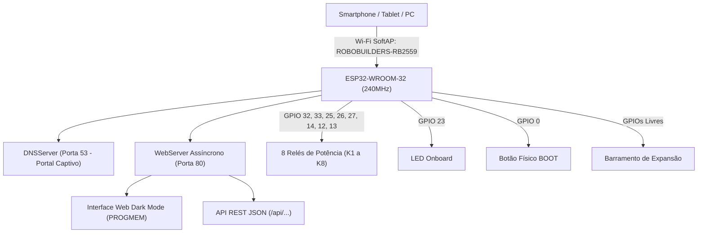

# 📘 DOCUMENTAÇÃO TÉCNICA: ROBOBUILDERS RB2559
### *Firmware de Teste e Diagnóstico de Hardware • ESP-32 RELAY_X8 (Módulo de 8 Relés)*

---

## 📋 Sumário
- [1. Visão Geral do Projeto](#1-visão-geral-do-projeto)
- [2. Especificações de Hardware](#2-especificações-de-hardware)
- [3. Mapeamento de Pinos (Pinout Oficial)](#3-mapeamento-de-pinos-pinout-oficial)
- [4. Arquitetura do Sistema](#4-arquitetura-do-sistema)
- [5. Recursos do Painel Web](#5-recursos-do-painel-web)
- [6. Documentação da API REST](#6-documentação-da-api-rest)
- [7. Guia de Conexão e Gravação UART (Passo a Passo)](#7-guia-de-conexão-e-gravação-uart-passo-a-passo)
- [8. Estrutura do Repositório](#8-estrutura-do-repositório)
- [9. Como Compilar e Enviar](#9-como-compilar-e-enviar)
- [10. Acesso ao Painel Web](#10-acesso-ao-painel-web)

---

## 1. Visão Geral do Projeto

O **ROBOBUILDERS RB2559** é o firmware oficial de diagnóstico, validação e teste de bancada (*Board Diagnostic & Factory Hardware Validation*) desenvolvido especialmente para a placa **`ESP-32 RELAY_X8`** (equipada com microcontrolador **ESP32-WROOM-32 / 32E** e **8 Relés de Potência**).

O sistema cria de forma autônoma um **Ponto de Acesso Wi-Fi (SoftAP)** com **Portal Captivo** e serve um painel web completo em **Modo Escuro (Dark Mode)**, permitindo o acionamento em tempo real dos **8 relés**, acionamento do LED onboard, leitura instantânea do botão de boot e controle de todas as GPIOs livres sem necessidade de conexão com a internet.

---

## 2. Especificações de Hardware

| Item | Especificação |
| :--- | :--- |
| **Identificador do Produto** | ROBOBUILDERS RB2559 |
| **Modelo da Placa Base** | `ESP-32 RELAY_X8` |
| **Microcontrolador** | ESP32-WROOM-32 / ESP32-WROOM-32E (Dual Core 32-bit LX6 @ 240 MHz, 4MB Flash, 520KB SRAM) |
| **Relés de Potência** | **8 Canais Independentes** (250V AC / 30V DC - 10A) com contatos COM, NO (Normal Aberto) e NC (Normal Fechado) |
| **LED Onboard / Status** | Indicador de Status no **GPIO 23** |
| **Relé 1 (K1)** | Acionamento no **GPIO 32** |
| **Relé 2 (K2)** | Acionamento no **GPIO 33** |
| **Relé 3 (K3)** | Acionamento no **GPIO 25** |
| **Relé 4 (K4)** | Acionamento no **GPIO 26** |
| **Relé 5 (K5)** | Acionamento no **GPIO 27** |
| **Relé 6 (K6)** | Acionamento no **GPIO 14** |
| **Relé 7 (K7)** | Acionamento no **GPIO 12** |
| **Relé 8 (K8)** | Acionamento no **GPIO 13** |
| **Botão de Usuário / Boot** | Entrada com resistor Pull-Up no **GPIO 0 (IO0)** |
| **Entrada de Alimentação** | Borne DC (7V a 30V DC) ou Borne/Conector 5V DC |
| **Interface de Gravação UART** | Header UART Serial de 6 pinos (TXD, RXD, IO0, EN/RST, GND, 5V/3V3) |

---

## 3. Mapeamento de Pinos (Pinout Oficial)

| Periférico / Pino | GPIO (ESP32) | Direção Padrão | Nível / Comportamento | Descrição |
| :--- | :---: | :---: | :---: | :--- |
| 🟢 **Relé 1 (K1)** | **`GPIO 32`** | OUTPUT | Active **HIGH** | Aciona a bobina do Relé 1 |
| 🟢 **Relé 2 (K2)** | **`GPIO 33`** | OUTPUT | Active **HIGH** | Aciona a bobina do Relé 2 |
| 🟢 **Relé 3 (K3)** | **`GPIO 25`** | OUTPUT | Active **HIGH** | Aciona a bobina do Relé 3 |
| 🟢 **Relé 4 (K4)** | **`GPIO 26`** | OUTPUT | Active **HIGH** | Aciona a bobina do Relé 4 |
| 🟢 **Relé 5 (K5)** | **`GPIO 27`** | OUTPUT | Active **HIGH** | Aciona a bobina do Relé 5 |
| 🟢 **Relé 6 (K6)** | **`GPIO 14`** | OUTPUT | Active **HIGH** | Aciona a bobina do Relé 6 |
| 🟢 **Relé 7 (K7)** | **`GPIO 12`** | OUTPUT | Active **HIGH** | Aciona a bobina do Relé 7 |
| 🟢 **Relé 8 (K8)** | **`GPIO 13`** | OUTPUT | Active **HIGH** | Aciona a bobina do Relé 8 |
| 🔵 **LED Onboard** | **`GPIO 23`** | OUTPUT | Active **HIGH** | LED indicador de status / atividade da placa |
| 🟡 **Botão Físico (IO0 / S1)** | **`GPIO 0`** | INPUT_PULLUP | Active **LOW** | Botão de usuário e seleção do modo Bootloader |
| 🔌 **UART0 TX** | **`GPIO 1`** | UART | Transmissão | Comunicação Serial / Gravação de Firmware |
| 🔌 **UART0 RX** | **`GPIO 3`** | UART | Recepção | Comunicação Serial / Gravação de Firmware |
| ⚙️ **Grade de GPIOs Livres** | `2, 4, 5, 15, 16, 17, 18, 19, 21, 22` | OUTPUT / INPUT | Configurável | Pinos digitais livres para expansão e testes |
| 📥 **Pinos Input-Only** | `34, 35, 36 (VP), 39 (VN)` | INPUT | Apenas Entrada | Entradas analógicas e sensores externos |

> [!NOTE]
> O **GPIO 12** é um pino de strapping (MTDI) no ESP32. Durante o boot ele é mantido em nível lógico baixo (`LOW`), garantindo a inicialização correta da memória flash antes de operar normalmente como saída de acionamento do Relé 7.

---

## 4. Arquitetura do Sistema



---

## 5. Recursos do Painel Web

O painel web roda diretamente na memória Flash do ESP32 através de `PROGMEM` e é servido de forma assíncrona com polling de atualização contínua (800ms):

1. **Seção 1 - Controle dos 8 Relés de Potência (K1 a K8)**:
   - **Cards Individuais para cada Relé**: Botão de alternância (Ligar / Desligar) com troca visual de cor e status (*ABERTO / FECHADO*).
   - **Função de Pulso de 1s**: Gera acionamento temporizado de 1 segundo para testes de carga e acionamento pulsado.
   - **Ações em Lote**: Botões **"⚡ Ligar Todos os 8 Relés"** e **"✖ Desligar Todos os Relés"**.

2. **Seção 2 - Recursos de Sistema Onboard**:
   - **LED Onboard (GPIO 23)**: Botão de liga/desliga contínuo e função de pulso rápido (*Piscar 500ms*).
   - **Botão Boot / IO0 (GPIO 0)**: Card interativo com monitoramento em tempo real do estado do botão (*Pressionado / Solto*).

3. **Seção 3 - Mapeamento e Controle de Todas as GPIOs Livres**:
   - Controle individual de cada pino digital.
   - Configuração de modo através do modal de engrenagem ⚙️ (**OUTPUT** ou **INPUT com Pull-Up**).
   - Proteção de hardware para os pinos `34, 35, 36 e 39` (bloqueados como apenas entrada).
   - Botões em lote para ligar/desligar todas as saídas livres.

4. **Portal Captivo Integrado**:
   - Ao conectar na rede Wi-Fi `ROBOBUILDERS-RB2559`, o dispositivo móvel abre automaticamente a página de controle.

---

## 6. Documentação da API REST

A placa disponibiliza uma API REST em formato JSON:

### `GET /api/status`
Retorna o tempo de atividade (*uptime*) em segundos e o estado atual de todas as GPIOs e relés.
```json
{
  "uptime": 24,
  "pins": [
    { "pin": 32, "mode": 0, "val": 1, "relay": 1 },
    { "pin": 33, "mode": 0, "val": 0, "relay": 2 },
    { "pin": 25, "mode": 0, "val": 0, "relay": 3 },
    { "pin": 26, "mode": 0, "val": 0, "relay": 4 },
    { "pin": 27, "mode": 0, "val": 0, "relay": 5 },
    { "pin": 14, "mode": 0, "val": 0, "relay": 6 },
    { "pin": 12, "mode": 0, "val": 0, "relay": 7 },
    { "pin": 13, "mode": 0, "val": 0, "relay": 8 },
    { "pin": 23, "mode": 0, "val": 0 },
    { "pin": 0, "mode": 1, "val": 1 }
  ]
}
```

### `GET /api/toggle?pin=<numero_gpio>`
Alterna o nível lógico do pino informado.
- **Exemplo**: `GET /api/toggle?pin=32` (Alterna o Relé 1)
- **Exemplo**: `GET /api/toggle?pin=23` (Alterna o LED Onboard)
- **Resposta**: `{"pin":32,"val":1}`

### `GET /api/relay?ch=<1..8>&state=<0|1>`
Controla diretamente um canal de relé específico pelo seu número (1 a 8).
- **Exemplo**: `GET /api/relay?ch=1&state=1` (Liga o Relé 1)
- **Exemplo**: `GET /api/relay?ch=8&state=0` (Desliga o Relé 8)
- **Resposta**: `{"relay":1,"pin":32,"val":1}`

### `GET /api/relay_all?state=<0|1>`
Liga ou desliga todos os 8 relés simultaneamente.
- **Exemplo**: `GET /api/relay_all?state=1` (Liga todos os 8 relés)
- **Exemplo**: `GET /api/relay_all?state=0` (Desliga todos os 8 relés)

### `GET /api/pulse?pin=<numero_gpio>&ms=<duracao_ms>`
Gera um pulso em nível alto (`HIGH`) na GPIO pelo tempo solicitado (em milissegundos).
- **Exemplo**: `GET /api/pulse?pin=32&ms=1000` (Aciona o Relé 1 por 1 segundo)
- **Exemplo**: `GET /api/pulse?pin=23&ms=500` (Pisca o LED Onboard por 500ms)

### `GET /api/mode?pin=<numero_gpio>&mode=<0|1>`
Altera o modo da GPIO (`0 = OUTPUT`, `1 = INPUT_PULLUP`).
- **Exemplo**: `GET /api/mode?pin=22&mode=1`

### `GET /api/all?state=<0|1>`
Altera todas as saídas de expansão configuradas como OUTPUT para nível 1 (`HIGH`) ou 0 (`LOW`).

---

## 7. Guia de Conexão e Gravação UART (Passo a Passo)

A placa **ESP-32 RELAY_X8** utiliza gravação via porta serial UART utilizando um conversor USB-Serial externo (**CP2102, FTDI FT232RL, CH340** ou **PL2303**).

### 1. Esquema de Ligação

```text
  +-------------------------+             +-------------------------------+
  |   Conversor USB-Serial  |             |      ESP-32 RELAY_X8          |
  |  (CP2102 / FTDI / CH340)|             |  (Header de 6 pinos UART)     |
  |                         |             |                               |
  |                     GND |<----------->| GND                           |
  |                TX / TXD |------------>| RX / RXD (GPIO 3)             |
  |                RX / RXD |<------------| TX / TXD (GPIO 1)             |
  |                5V / 3V3 |------------>| 5V / 3V3                      |
  +-------------------------+             +-------------------------------+
```

> [!CAUTION]
> **Aviso de Segurança Elétrica**: **NUNCA** conecte o conversor USB-Serial ao computador se a placa estiver ligada à rede elétrica AC (110V/220V). Desconecte totalmente a alimentação de alta tensão antes de realizar a gravação.

---

### 2. Procedimento para Modo Bootloader (Gravação)

1. Conecte os pinos do conversor USB-Serial (**GND, TX, RX, 5V/3V3**).
2. Conecte temporariamente o pino **`IO0` ao `GND`** (ou mantenha pressionado o botão físico **`BOOT / IO0`**).
3. Pressione e solte o botão **`EN / RST`** (ou conecte o cabo USB no computador com o `IO0` em nível baixo).
4. Inicie o upload pelo PlatformIO ou Arduino IDE.
5. Ao concluir o envio, solte o `IO0` do `GND` e pressione **`EN / RST`** para iniciar o firmware gravado.

---

## 8. Estrutura do Repositório

```text
RB2559/
├── README.md                       <- Documentação técnica principal
└── Documentação da placa e projeto WEB/
    ├── include/
    │   └── web_page.h              <- Interface Web completa em PROGMEM (8 Relés, Dark Mode, Responsivo)
    ├── src/
    │   └── main.cpp                <- Firmware PlatformIO (SoftAP, DNS, API REST, 8 Relés)
    ├── ROBOBUILDERS_RB2559/        <- Projeto pronto para Arduino IDE
    │   ├── ROBOBUILDERS_RB2559.ino
    │   └── web_page.h
    ├── platformio.ini              <- Configurações de build do PlatformIO
    └── README.md                   <- Documentação técnica da pasta
```

---

## Como Compilar e Gravar via PlatformIO CLI

O gerenciamento, compilação e gravação do projeto são feitos diretamente via **PlatformIO Core (CLI)** pelo terminal.

### 1. Compilar o Firmware
`ash
pio run
`

### 2. Gravar o Firmware na Placa
`ash
pio run -t upload
`

### 3. Especificar a Porta Serial Manualmente
`ash
pio run -t upload --upload-port COM3
`

### 4. Abrir o Monitor Serial
`ash
pio device monitor
`

### 5. Limpar Arquivos de Build
`ash
pio run -t clean
`

---

## Opção Alternativa: Arduino IDE

Se optar por utilizar a Arduino IDE:
1. Abra o arquivo ROBOBUILDERS_RB2559/ROBOBUILDERS_RB2559.ino.
2. Em **Ferramentas > Placa > ESP32 Arduino**, selecione **ESP32 Dev Module**.
3. Selecione a **Porta COM** correspondente ao seu conversor USB-Serial.
4. No **Gerenciador de Bibliotecas**, instale a biblioteca ArduinoJson (versão 6.x).
5. Clique em **Carregar (Upload)**.


### Opção A: Via PlatformIO (VS Code / CLI)
1. Abra a pasta do projeto no VS Code com a extensão PlatformIO.
2. Para compilar:
   ```bash
   pio run
   ```
3. Para gravar no ESP32:
   ```bash
   pio run --target upload
   ```
4. Para abrir o monitor serial (115200 bps):
   ```bash
   pio device monitor -b 115200
   ```

### Opção B: Via Arduino IDE
1. Abra o arquivo [`ROBOBUILDERS_RB2559.ino`](ROBOBUILDERS_RB2559/ROBOBUILDERS_RB2559.ino) localizado dentro da pasta `ROBOBUILDERS_RB2559`.
2. Em **Ferramentas > Placa**, selecione **ESP32 Dev Module**.
3. No Gerenciador de Bibliotecas, confirme a instalação da biblioteca **ArduinoJson** (versão 6.x).
4. Selecione a porta COM correspondente e clique no botão **Carregar**.

---

## 10. Acesso ao Painel Web

1. Energize a placa **ROBOBUILDERS RB2559 (ESP-32 RELAY_X8)**.
2. No celular ou computador, conecte-se à rede Wi-Fi criada pela placa:
   - **SSID**: `ROBOBUILDERS-RB2559`
   - **Senha**: *(Rede Aberta)*
3. Acesse pelo navegador:
   - **URL**: `http://192.168.4.1`
